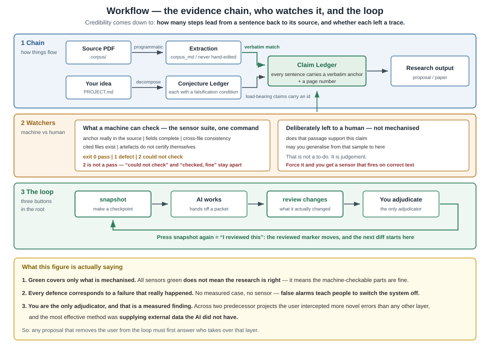
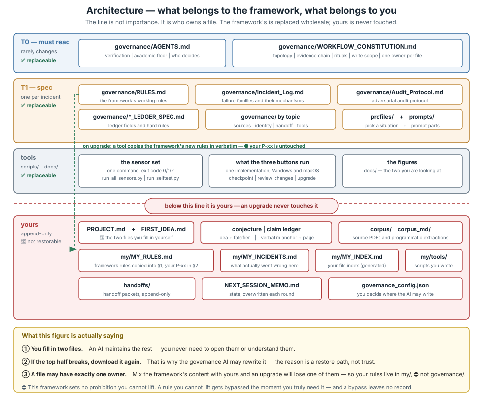

# Spark2Groundwork | The Researcher's Power Tool for Developing Ideas with AI

**Keep track of where ideas came from, what supports each claim, and the decisions you make.**

[繁體中文](README.md) ｜ [What changed in each release](CHANGELOG.md)

## Let AI help, while keeping the work understandable

You have a research idea. You want to find literature, clarify the question, strengthen the argument, and write a proposal. AI can help, but fluent prose does not necessarily have evidence behind it, and a complete answer may contain unverified inferences.

Spark2Groundwork is a set of working rules, document templates, and checks kept in your research project folder. It asks AI to record ideas, identify sources, explain changes, and bring decisions back to you.

| What you want to know | How the framework helps |
|---|---|
| Is this idea worth pursuing? | A conjecture ledger records reasons, unknowns, and conditions that could falsify it |
| Where is the evidence for this claim? | A claim ledger points to verbatim anchors and page numbers in sources |
| What changed, and what have I not reviewed? | Save progress, inspect differences, and record human review separately |
| How do I resume after a break or switch AI assistants? | Handoff packets and a working memo carry the context forward |

**You do not need programming knowledge, but you do need to take part in research decisions.** The framework helps expose gaps and retain traceable records. It cannot guarantee that every error will be found or that your conclusions are correct.

## No framework starts perfect. It becomes more useful as you make it your own.

**Spark2Groundwork starts from this premise: the framework needs to grow alongside your research.** Different topics, AI assistants, and working habits reveal different problems. Downloading a framework does not make errors disappear. What matters is turning the problems you encounter into experience you can use next time.

| What happens in your research | What you keep from it |
|---|---|
| You catch an AI error, or find a workflow that does not fit the project | Ask AI to record the incident, its consequences, and the context |
| After a few experiences, you ask AI to help look back | Identify recurring causes and failure patterns, beyond the details of one mistake |
| AI proposes an improvement and you assess whether it fits | You decide whether to change the workflow or add or revise a project rule |

**The middle step matters.** The next mistake may look different. Understanding recurring causes helps you recognise them in a new situation. Improvement does not mean adding a prohibition after every incident: consider whether a rule helps and whether it creates unnecessary work.

**The final decision is always yours.** AI can document, analyse, and propose changes, but it must not turn its own suggestions into rules that bind the project from then on.

Over time, your copy may differ from someone else's because it reflects your research experience and increasingly fits how you work. **That is the design's purpose.** Keep the reasons for changes so the next AI can understand those choices. Store project-specific rules and incident records in `my/` so they can be preserved separately from updates to the public framework.

## Start with one folder

1. Download and extract a version from [Releases](https://github.com/yama-learns/Spark2Groundwork/releases). For actual research, choose a published release; a development branch may not have completed acceptance checks.
2. Take only `Spark2Groundwork_en/`, copy it to your working location, and rename it for your project. For Traditional Chinese, take `Spark2Groundwork_zh/`. **Each edition is complete on its own; you do not need both.**
3. Open `SETUP.md` in that folder. Give an AI with local file access access to your project, and start with `INITIALIZE_PROMPT.md`.
4. Fill in `PROJECT.md` and `FIRST_IDEA.md` with your research direction, boundaries, and original idea. AI can help maintain the other records.
5. Follow setup to check the tools and review the initial contents before starting the first round.

Automatic checks and snapshots need working Python and Git installations. The setup guide and local startup help explain installation. Use `.bat` launchers on Windows and `.command` launchers on Mac. A launcher may open a terminal window to display results; routine use is not designed to require typing or pasting commands. If startup is blocked, follow the [startup help](Spark2Groundwork_en/docs/START_HERE.html).

An AI's ability to read files does not mean it can run tools on your computer. Chat-only environments with uploaded attachments can follow the [chat-only workflow](Spark2Groundwork_en/profiles/PROFILE_chat_only.md), with manual document transfers. Results from a remote environment do not establish that checks passed locally.

## What does a round of work look like?

Agree on the question for this round before AI starts. At handoff, ask it to explain the changes, evidence, unresolved questions, and decisions that need your attention. Confirm review only after examining the research and the changes.

v1.4.5 separates common actions so that “saved” does not silently become “reviewed by you”:

| Launcher | When to use it |
|---|---|
| save_progress | Save current work without claiming human review or moving the reviewed marker |
| review_changes | Inspect differences from the human-reviewed baseline; without a trustworthy baseline, do not conclude there is no unread work |
| snapshot | **Use only after you have reviewed the contents**, to establish or update the human-reviewed baseline; AI must not do this for you |
| check_project | Check the tool environment and automated checks; read whether results pass, identify defects, or remain inconclusive |
| sync_rules | Add missing framework clauses and check existing text for drift; you decide how to resolve differences |
| check_update | Check versions and differences for a downloaded update; it does not apply the update |

For a new project, follow setup to review the initial contents and establish a human-reviewed baseline before assigning work. Save progress if you have not finished reading. See [updating, saving, and human review](Spark2Groundwork_en/docs/UPDATE.md) for details.

## What does a passing check mean?

Automated checks can help determine whether a quotation anchor occurs in extracted text, required fields are present, referenced files exist, and certain cross-document rules agree.

**Whether a source supports your inference, a method is appropriate, or a result generalises still requires substantive judgment.** A text match does not establish support. A filled-in falsification condition is not necessarily observable or testable.

Results distinguish “passed,” “defect found,” and “inconclusive.” Missing material, missing tools, and claims that never entered verification cannot count as passing. Sensors cover only their defined checks. A human-reviewed marker is a working record, not programmatic proof that you understood the material.

## Keep your research separate from the replaceable framework

Research drafts, sources, ledgers, custom rules, and project settings are yours to preserve. Public framework rules, prompt templates, tools, and documentation can be updated. Put custom tools in `my/tools/`, away from the replaceable `scripts/` folder.

**Make a complete backup outside the project before upgrading.** A Git snapshot may exclude files and is not a substitute for that backup. Follow the [update guide](Spark2Groundwork_en/docs/UPDATE.md) to compare and update packages individually; do not overwrite your research project with an entire downloaded folder.

## v1.4.5 and the coming v2

v1.4.5 focuses on Windows/Mac entry points, dependency and error guidance, the distinction between saving and human review, and update preparation for existing projects.

> Platform verification scope: Mac automated processes are checked in GitHub Actions; native Finder, Gatekeeper and physical-machine double-click acceptance remain pending and are not reported as passed.

**v2 is in development as a redesign.** Its goals include clearer file ownership, one shared core with updates for the selected language, and more complete records of sources, claims, verification, and human decisions. These are development goals, not features delivered by v1.4.5.

See the [v2 preview in the changelog](CHANGELOG.md#v2-preview). You do not need to reorganise your research folder now. Start with backups and an inventory using [v2 preparation](Spark2Groundwork_en/docs/V2_PREPARATION.md). An AI-assisted migration guide will be planned as v2 approaches completion.

## AI collaboration and acknowledgements

**Yama leads the design and maintenance of Spark2Groundwork**, defining research needs, product direction, task assignments, and final decisions. Development uses several AI tools to assist with planning, implementation, testing, review, and documentation.

| AI tool | Participation in this project |
|---|---|
| **OpenAI Codex** | Planning, implementation, testing, and review through project roles including Astra and Sol |
| **Anthropic Claude** | Implementation, independent review, research workflow assessment, and documentation |
| **Google Gemini** | Primary implementation, revisions, testing, and design proposals |

These descriptions summarise participation over time; Yama assigns tasks for each round. Roles, model versions, and verification scope for individual contributions are distinguished in the actual records. Using these tools does not mean every result was reviewed by every model, or that their providers maintain, sponsor, or endorse the project.

We acknowledge AI contributions while retaining human responsibility: AI supplies proposals and work products; Yama decides the project's direction and whether to accept the results. Users remain responsible for assessing their own research content.

## Licence

The framework uses the [MIT licence](LICENSE). Research you produce with it remains yours; rights to cited material are governed by its original sources.
