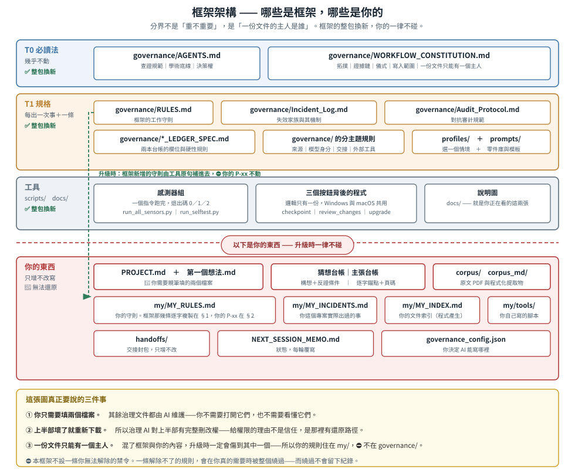
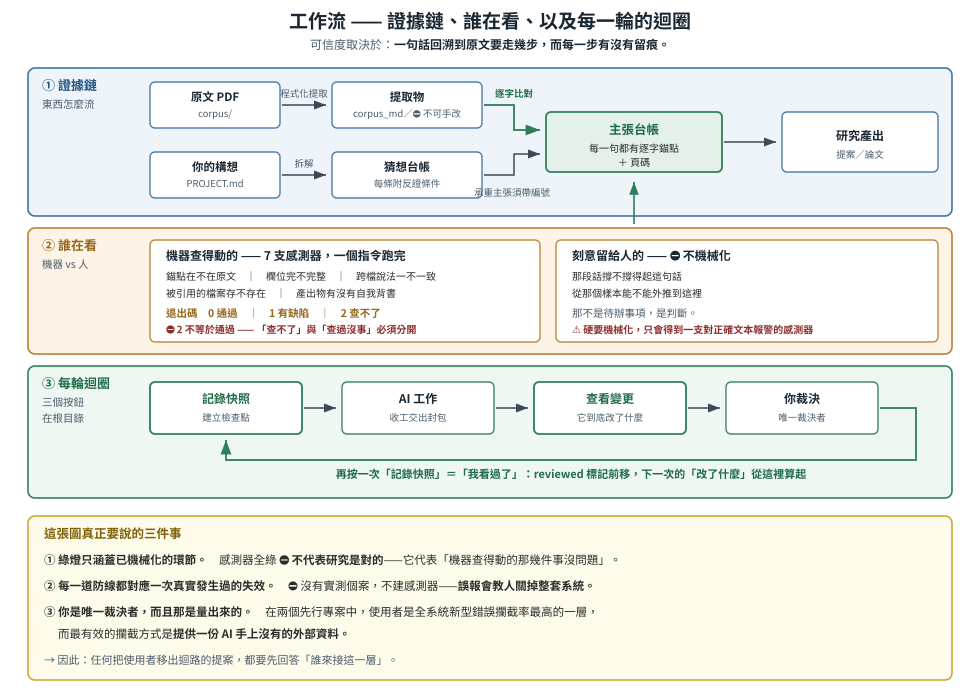

# Spark2Groundwork（繁體中文版）

## v1.4.5 與 v2 預告

本候選改善 Mac／Windows 操作入口、缺依賴說明與錯誤分級。正常使用不需貼終端機命令；Mac 雙擊後可顯示執行結果。完整發行尚待最終平台驗收。

v2 正在開發，目標是共用核心、所選語言的更新、專案資料與框架分離，以及可追溯的來源、主張與人類裁決。這些是開發目標，並非 v1.4.5 已有功能。

現在請先閱讀 [v2 升級準備](docs/V2_PREPARATION.md)。v1.4.5 不是未來遷移的必要前置。


第一次設定或日常檢查：雙擊 **檢查專案.bat／檢查專案.command**；缺工具時看[啟動說明](docs/START_HERE.html)。不需貼命令。

**把一個發想，變成一份站得住的研究提案。**

---

## 你只需要做三件事

| 做什麼         | 在哪裡                                                               |
| -------------- | -------------------------------------------------------------------- |
| **填兩個檔案** | 資料夾裡的 `PROJECT.md` 與 `第一個想法.md`。⛔ 其他治理文件都由 AI 維護，你不必打開 |
| **使用操作按鈕** | 檢查專案／記錄快照／查看變更／檢查更新（Windows 用 `.bat`，Mac 用 `.command`） |
| **做決定**     | AI 提出建議，你決定要不要採納。**這一步不能外包**                    |

更新前先完整備份，依 [更新指引](docs/UPDATE.md) 比對框架檔與自訂內容。請勿用整個下載資料夾覆蓋研究專案。

---

## 0. 這是什麼

**一組你複製到專案資料夾裡的檔案。**
它們給 AI 一套工作規則，也給你一套檢查方式。

它的出發點只有一句話：**AI 會出錯，而且會在它聽起來最有把握的地方出錯。**
框架裡的每一條工作規則，都對應一次真的發生過的事。

| 它幫你回答的問題                     | 靠什麼回答                       |
| ------------------------------------ | -------------------------------- |
| **這句論述的根據在原文獻的哪一頁？** | 主張台帳，加上自動比對原文的檢查 |
| **這個想法要怎樣才算被推翻？**       | 猜想台帳裡的「反證條件」欄       |
| **AI 剛才改了什麼？我看過了沒有？**  | Git 檢查點，加上「查看變更」按鈕 |

---

## 1. 它不宣稱的事（**請先讀這段**）

⛔ **本框架不保證你的研究是對的。**
它保證的是另一件比較窄、但比較有用的事：
**當某個地方出錯時，錯誤會留下痕跡，而不是靜靜地變成你的結論。**

| 它查得到                       | 它查不到                           |
| ------------------------------ | ---------------------------------- |
| 你引用的那句話，在不在原文獻裡 | 原文獻的論述是不是真的支持你的推論 |
| 你有沒有填寫反證條件           | 你填的那個條件是不是真的觀察得到   |
| 同一條工作規則有沒有兩個版本   | 那條工作規則本身對不對             |

**右邊那一欄是人的工作，而且我們刻意不把它自動化。**
一支會對正確文本亂報警的檢查，會教會你忽略它——**那比沒有檢查更糟。**

---

## 2. 資料夾裡有什麼

<p align="center">
  
</p>

⚠️ **紅線以上是框架，若AI改壞了，重新下載就好。**
🔴 **紅線以下是你的資料，沒有任何地方可以還原——請自己另外備份。**

**你的東西（升級永不替換）：**

```
PROJECT.md            ← 你的專案身分、價值與界線
第一個想法.md         ← 你要交給 AI 拆解的原始構想
my/                   ← 🔴 這裡面每一樣都是你的
  MY_RULES.md         ←   你的工作守則。框架那幾條逐字複製在 §1，你自己的 P-xx 在 §2
  MY_INCIDENTS.md     ←   你這個專案實際出過的事
  MY_INDEX.md         ←   你的文件索引（由程式產生，⛔ 不用手寫）
  tools/              ←   你自己寫的腳本。⛔ 不要放進 scripts/，那裡升級時整包換掉
corpus/               ← 你的論文 PDF 放這裡，書目總表也在這裡
corpus_md/            ← 由程式從 PDF 抽出來的純文字，供比對用
ledgers/              ← 台帳：你的構想，以及每一句話的出處
handoffs/             ← 交接封包：每一輪做了什麼
NEXT_SESSION_MEMO.md  ← 工作狀態，每輪覆寫
governance_config.json ← 你決定 AI 能寫哪裡
```

**框架的（壞了就重新下載）：**

```
SETUP.md              ← 🚩 從這裡開始。安裝、填空、第一次執行
INITIALIZE_PROMPT.md  ← 第一次要貼給 AI 的那段話
governance/           ← AI 要遵守的規則、兩本台帳的欄位規格，
                         以及分主題的規則：來源、交接、模型身分、外部工具
profiles/             ← 選一份符合你工作方式的設定
prompts/              ← 現成的指令，可以直接貼
scripts/harness/      ← 自動檢查程式
docs/                 ← 說明圖
file_index.md         ← 框架自己的檔案索引（⛔ 你的文件不要登記在這裡）
```

🔴 **為什麼要分這兩堆：一份文件只能有一個主人。**
**混了框架與你的內容，升級時一定會傷到其中一個——**
⚠️ **所以你的工作守則住在 `my/`，⛔ 不在 `governance/`。**

**框架新增守則時，會有一支工具把新條文原句補進 `my/MY_RULES.md`，
而你自己寫的 `P-xx` ⛔ 不會被動到。**

---

## 3. 四個核心概念

<p align="center">
  
</p>

### 3.1 從「原文獻的論述」走到「你自己的推論」，中間有好幾個環節

一句帶數字的話，從「想法」走到「寫進提案」，中間要經過七個環節。
**每個環節都可能斷，而且斷掉的樣子不一樣。**

| 環節       | 要問的問題                 | 能不能自動查              |
| ---------- | -------------------------- | ------------------------- |
| ① 定位     | 我該引哪一段？             | ❌ 人的工作               |
| ② **存在** | **那段話真的在原文裡嗎？** | ✅ **可以，而且成本是零** |
| ③ 欄位     | 該填的欄位填了嗎？         | ✅ 可以                   |
| ④ 一致     | 不同檔案裡的說法一致嗎？   | ✅ 可以                   |
| ⑤ 真偽     | 這篇文獻真的存在嗎？       | ✅ 可以，但要另外查證     |
| ⑥ 支持     | 那段話撐得起這句話嗎？     | ❌ 人的工作               |
| ⑦ 外推     | 從那個樣本推得到你這裡嗎？ | ❌ 人的工作               |

🔴 **第 ② 個環節是整套設計的支點。**
它把「到底有沒有人真的翻開原文看過」這件事，
**變成一個用字串比對就能回答的事實。**

### 3.2 兩本台帳，管兩件不同的事

|            | 猜想台帳                         | 主張台帳                         |
| ---------- | -------------------------------- | -------------------------------- |
| 管什麼     | **想法層次**：這個構想站不站得住 | **句子層次**：這句話靠哪一段原文 |
| 主要欄位   | 反證條件、最強的競爭解釋         | 原文的逐字錨點、頁碼             |
| 會出什麼事 | 想法慢慢變成怎麼樣都推不翻的信念 | 數字被憑印象重新寫了一次         |

### 3.3 自動記錄錯誤，自主完善框架

**為單一錯誤想對策的效益有限**，因為下一次不會長得一樣。
要記下來的是錯誤的**模式**——這樣你下次才認得出來。

**而找模式這件事，可以交給 AI 做。**
你只要在出事的當下說一句「把這件事記下來」，剩下的整理由它負責；
🔴 **於是這個框架會隨著你的使用一起長大，最終變成你用得最順手的樣子。**

**框架自己帶來的失效模式清單在 `governance/Incident_Log.md`；
你這個專案自己出過的事，記在 `my/MY_INCIDENTS.md`。**

### 3.4 你是唯一的決定者

⚠️ **這不是保守，是實際量出來的結果。**
在兩個先行專案裡，**使用者攔下的「全新錯誤」比系統裡任何其他一層都多**，
而他最有效的方法不是「看出 AI 答錯了」，
**而是拿出一份 AI 手上沒有的外部資料。**

**→ 任何想把使用者移出流程的做法，都要先回答一個問題：誰來接這一層？**

---

## 4. 沒有完美的框架，只有愈用愈順手的框架

🔴 **這一節是這套東西的核心理念。**

**沒有任何一套框架，一開始就剛好適合你的題目、你的 AI、你的工作習慣。**
⛔ **我們也不打算假裝有。**

**它的設計前提是另一件事：讓每一次踩到的坑，都能變成下一次的護欄。**

| 你做什麼 | 框架長出什麼 |
|---|---|
| 發現 AI 做錯了一件事，說一句「記下來」 | `my/MY_INCIDENTS.md` 多一筆 |
| 累積幾筆之後，請 AI 找出重複的模式 | 你看見一個**會再犯**的形狀 |
| 你決定要不要把它變成規則 | `my/MY_RULES.md` 多一條，**而且是你這個專案專用的** |

⚠️ **中間那一步不能省。** 單獨一次錯誤幫不上忙，因為下一次不會長得一樣；
**有價值的是重複出現的形狀。**

⛔ **最後那一步一定是你決定，不是 AI 決定**——
**因為那條規則之後會同時約束你們兩個。**

**用上一段時間之後，你的規則集會和別人的不一樣。**
🔴 **那不是走樣，那正是目的。**

⚠️ **這也是升級不會蓋掉你東西的原因，而它的道理和你想的可能相反：**
🔴 **升級工具只認得可替換清單上明列的項目，其餘一律拒絕。**
**所以你的台帳、語料、事故簿、`PROJECT.md`、`第一個想法.md`，
以及⛔ 任何你自己開的資料夾，都不會被碰**——
**你不需要事先把它們登記在任何清單上。**

---

## 5. 這套東西從哪裡來

**兩個實際運行過的研究專案，合計四十幾筆記錄下來的失誤。**
框架裡的每一支檢查、每一條硬性規則，都附著那個把它逼出來的真實案例。

⛔ **沒有真實案例的規則，不會被寫進來。**

⚠️ 但有一個例外，而且它正是這套框架存在的理由：
`governance/Incident_Log.md` 裡標為 `[繼承]`、`[框架自身]` 或 `[預測]` 的那些模式，
**在你的專案裡還沒有發生過。**
它們列在那裡是要讓你知道該提防什麼——⛔ **不是讓你以為自己已經免疫了。**

---

## 6. 下一步

👉 **打開 `SETUP.md`，照著做。**

---

## 授權

**本框架以 MIT 授權釋出**，來源：https://github.com/yama-learns/Spark2Groundwork

⚠️ **這句話只涵蓋框架檔案本身。**
**你用它做出來的研究是你的**——⛔ 本框架不對你的成果主張任何權利，也不承擔任何責任。


只存未讀內容請按「儲存進度」；「記錄快照」仍代表人工已閱。更新與同步規則的免命令路徑見[操作說明](docs/UPDATE.md)。
